# Arsitektur

Gambar versi PNG ada di `docs/img/`. Diagram di bawah ditulis dengan Mermaid
supaya bisa diubah tanpa membuka aplikasi gambar; PNG-nya hasil render dari
sumber yang sama.

Dokumen ini menjelaskan **bentuk sistemnya**. Yang menjelaskan kenapa keputusan
tertentu diambil ada di catatan keputusan `CLAUDE.md`.

> **Membuat ulang PNG-nya.** Sumbernya cuma satu — blok Mermaid di berkas ini.
> `docs/img/_sources.json` diambil dari sini, dan `docs/img/render.html`
> merendernya. Tidak ada diagram yang diketik dua kali, jadi gambar tidak bisa
> melenceng dari teksnya tanpa ada yang sengaja membuatnya melenceng.

---

## 1. Lapisan

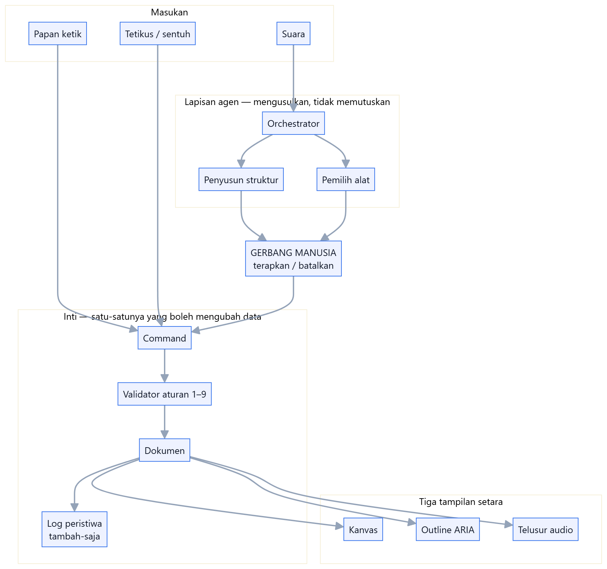

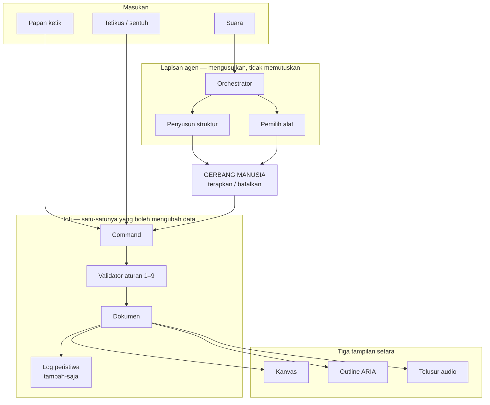

Tiga hal yang dikunci gambar ini:

1. **Papan ketik dan tetikus masuk langsung ke command.** Mereka tidak melewati
   agen, karena tidak ada yang perlu ditafsirkan.
2. **Suara tidak pernah sampai ke command tanpa melewati gerbang.**
3. **Ketiga tampilan membaca dokumen yang sama.** Tidak ada tampilan yang
   menurunkan isinya dari tampilan lain.

---

## 2. Satu pintu menuju data

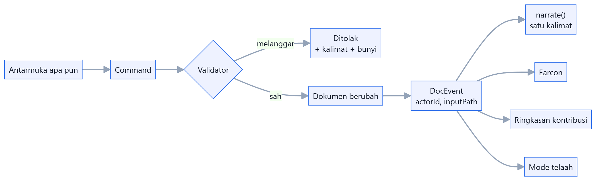

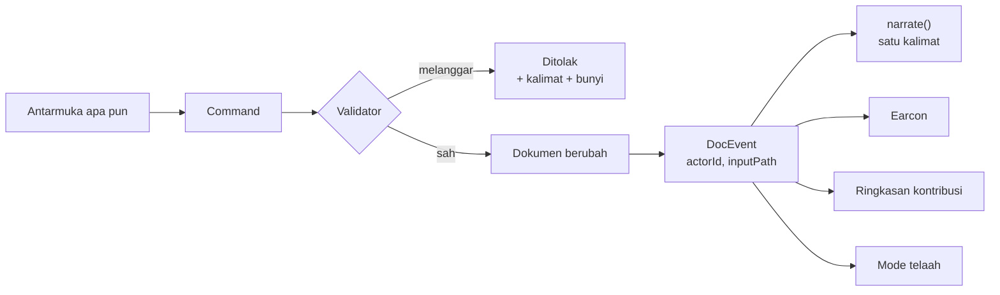

`DocEvent` ada sejak P0 dan bukan kemewahan: **satu struktur melayani empat
fitur.** Atribusi tidak bisa ditambahkan belakangan tanpa membuat halaman
ringkasan berbohong.

Di mana tiap aturan ditegakkan:

| Aturan | Ditegakkan di | Bagaimana |
| ------ | ------------- | --------- |
| 1 satu induk | `checkMove`, `projectTree` | Pindah ke keturunan sendiri ditolak; siklus dipulihkan saat membaca |
| 2 tanpa makna di koordinat | `core/model/types.ts` | `Node` tidak punya `x`, `y`, `width`, `color` |
| 3 semua bertipe | `checkKind` | Tipe di luar daftar ditolak |
| 4 judul sepanjang napas | `checkTitle` | 60 karakter |
| 5 satu peristiwa satu kalimat | `narrate.ts` | Tipe peristiwa tanpa kalimat = kesalahan kompilasi |
| 6 tiga jalur | tinjauan manusia | Tidak bisa dipaksa mesin; ada di daftar periksa |
| 7 aksesibilitas bawaan | tidak ada sakelar | Tidak ada mode aksesibel untuk dinyalakan |
| 8 batal + narasi + gerbang | `MemoryDocStore.undo`, dialog | Snapshot; perubahan berat lewat dialog |
| 9 audio langka | `audio/bus.ts` | Profil menyaring; narasi menunggu jeda bicara |

---

## 3. Model data

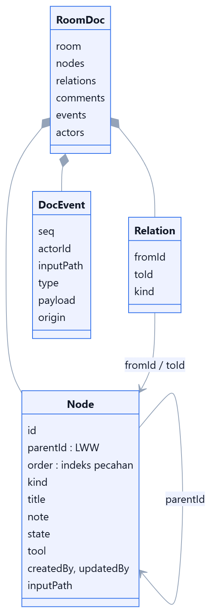

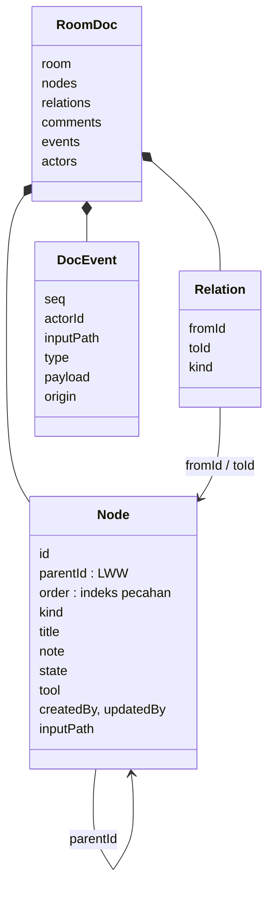

Yang membuat model ini tahan gabungan:

- **`parentId` satu field LWW + indeks pecahan** untuk urutan, bukan array anak
  di dalam induk. Array menghasilkan duplikat saat pindah bersilangan, dan
  duplikat tidak bisa dideteksi. LWW paling buruk menghasilkan siklus, dan
  siklus bisa dipulihkan deterministik (D9, D10).
- **Tidak ada koordinat.** Penempatan tangan disimpan di perangkat, per bentuk
  visual, tidak pernah masuk dokumen (D31).
- **`tool` cuma menyatakan cara menggambar.** Isinya anak-anaknya sendiri, jadi
  alat tidak pernah memiliki data (D40).

---

## 4. Bentuk visual dan alat: tata letak, bukan tipe data

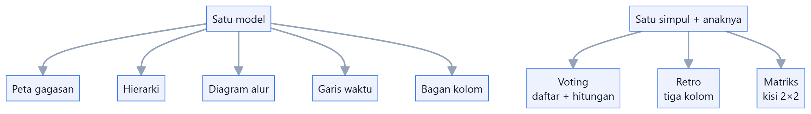

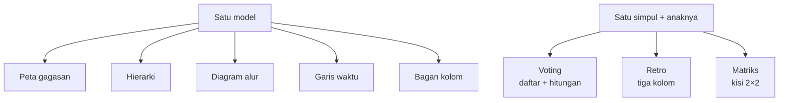

Bentuk menata seluruh ruang; alat menata satu simpul beserta anaknya. Keduanya
**algoritma tata letak atas model yang sama**, bukan tipe data baru — dan itulah
kenapa mengganti bentuk aman dan mematikan alat tidak menghilangkan apa pun.

Matriksnya bukti paling jelas bahwa aturan 2 itu keunggulan: kuadran adalah
simpul kelompok, jadi letak sebuah item bisa dibacakan dengan kata, dan
memindahkannya antar kuadran cuma `moveNode`.

---

## 5. Jalur suara

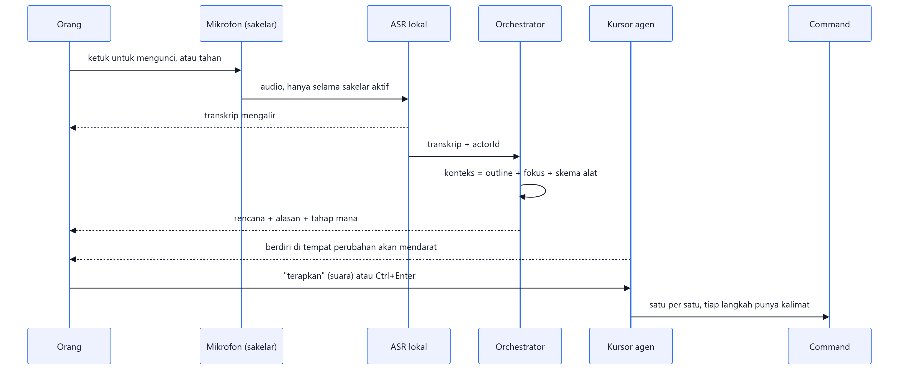

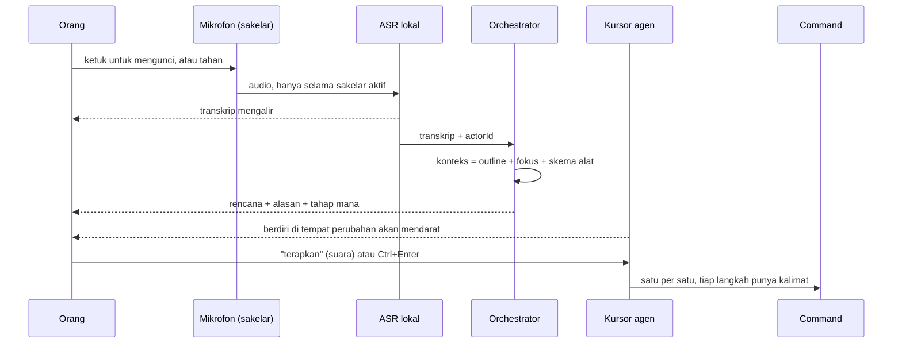

Yang dijaga di jalur ini:

- **Mikrofon hidup hanya selama sakelar aktif** — janji privasi yang bisa
  diucapkan dalam satu kalimat.
- **Transkrip mengalir** — itu yang membuat 2–3 detik terasa nol.
- **Yang dikirim ke model struktur, bukan tangkapan layar**, dan bisa dibaca
  orang sebelum dijawab.
- **Menerapkan itu pertunjukan**, bukan penumpahan: tiga operasi jadi tiga
  kalimat yang bisa diikuti pembaca layar.

---

## 6. Penyimpanan dan sinkronisasi

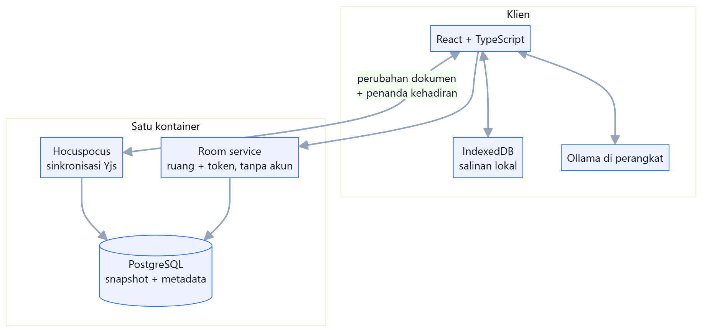

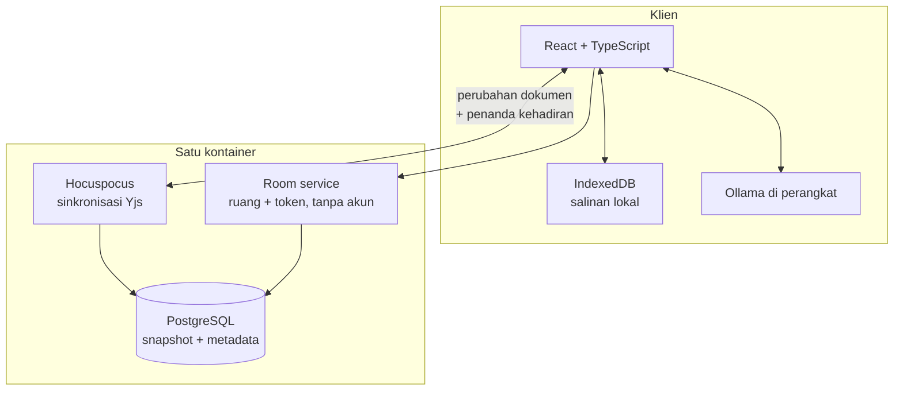

**Yang melintasi jaringan hanya dua hal: perubahan dokumen dan penanda
kehadiran.** Tidak ada audio, tidak ada gambar, tidak ada koordinat. Justru
karena itu ruang ini tetap nyaman di sambungan lemah.

Dua mode pemasangan, **beda konfigurasi saja**:

| | Mode kelas | Mode lintas daerah |
| - | ---------- | ------------------ |
| Tempat | Satu laptop pengajar | Klaster institusi |
| Basis data | SQLite | PostgreSQL |
| Jaringan | Lokal, tanpa internet | Publik atau intranet |
| Model | Ollama di perangkat | Ollama, atau vLLM institusi |

PostgreSQL jadi bawaan untuk pemasangan sungguhan (keputusan pemilik proyek,
8 September 2026). SQLite tetap ada khusus mode kelas: memasang Postgres di
laptop pengajar yang cuma dipakai satu ruangan adalah beban tanpa imbalan.

Redis, Traefik, dan orkestrasi kontainer masuk **hanya kalau Hocuspocus lebih
dari satu instans**. Sebelum itu tujuh komponen untuk melayani dua hal.

---

## 7. Skalabilitas: empat tahap dan pemicunya

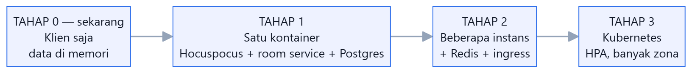

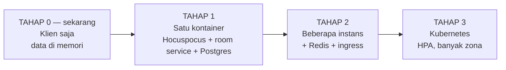

Ini bagian yang paling gampang ditulis secara keliru di sebuah proposal, jadi
ditulis apa adanya: **yang dibangun sekarang Tahap 0.** Tiga tahap berikutnya
adalah rancangan beserta pemicunya, bukan klaim.

| Tahap | Isinya | Pindah ke tahap berikutnya ketika |
| ----- | ------ | --------------------------------- |
| **0** | Klien saja. `MemoryDocStore`, data contoh, Ollama di perangkat. | Butuh dua orang di satu ruang. |
| **1** | Satu kontainer: Hocuspocus + room service + PostgreSQL, di satu proses. Mode kelas memakai SQLite. | Satu instans tidak lagi cukup — lihat tabel kapasitas. |
| **2** | Beberapa instans Hocuspocus, Redis sebagai penghubung antar instans, ingress di depan. | Perlu penskalaan otomatis, pemulihan sendiri, atau beberapa zona. |
| **3** | Kubernetes: HPA, PodDisruptionBudget, sesi lengket per ruang, beberapa zona. | — |

### Kenapa Kubernetes tidak diasumsikan sejak Tahap 0

Bukan karena tidak akan dipakai, melainkan karena **memakainya lebih awal
menghilangkan dua hal sekaligus**: waktu yang seharusnya dipakai membuktikan
klaim produk, dan kemampuan dipasang oleh sekolah yang tidak punya orang
infrastruktur.

Tiga alasan yang bisa diperiksa:

1. **Bebannya bukan CPU, melainkan sambungan yang hidup lama.** Yang melintas
   cuma perubahan dokumen dan penanda kehadiran — beberapa kilobita per menit
   per orang. Ini bukan beban yang butuh sepuluh pod; ini beban yang butuh satu
   proses yang tidak jatuh.
2. **Ruang itu stateful.** Semua peserta satu ruang harus mendarat di instans
   yang sama, atau Redis yang menyambungkan mereka. Menambah instans **tanpa**
   Redis tidak menambah kapasitas, cuma menambah bug. Jadi Tahap 2 dan Tahap 3
   memang datang bersama, dan sebelum keduanya dibutuhkan, keduanya cuma
   komponen yang harus dirawat.
3. **Mode kelas adalah janji produk, bukan kompromi.** Satu kontainer di laptop
   pengajar, tanpa internet. Arsitektur yang menganggap klaster sebagai dasar
   membuat janji itu jadi jalur khusus yang cepat rusak; arsitektur yang
   menganggap satu kontainer sebagai dasar membuat klaster jadi konfigurasi.

Yang **sudah** disiapkan supaya Tahap 2 dan 3 bukan tulis ulang:

- Hocuspocus **tanpa state**; yang persisten cuma di PostgreSQL.
- Kehadiran di kanal terpisah (Awareness), jadi bisa pindah ke Redis tanpa
  menyentuh dokumen.
- Room service kecil dan tanpa akun; token, bukan sesi.
- Klien punya salinan lokal, jadi instans yang dimulai ulang bukan kehilangan
  data melainkan sambungan yang tersambung lagi.

### Perkiraan kapasitas

Angka di bawah **perkiraan yang harus diukur**, bukan hasil pengukuran. Ditulis
supaya ada yang bisa dibantah, dan supaya pemicu pindah tahap punya bentuk.

| Besaran | Perkiraan | Dasarnya |
| ------- | --------- | -------- |
| Ukuran dokumen satu ruang | 50–200 KB | 200 simpul + log peristiwa satu sesi |
| Memori per ruang aktif di server | ~1–3 MB | Dokumen + Awareness + buffer |
| Lalu lintas per orang | ~2–10 KB/menit | Perubahan dokumen + penanda 10/detik |
| Ruang serentak per instans | **100–300** | Batasnya memori dan jumlah socket, bukan CPU |
| Orang serentak per instans | **500–1500** | Rata-rata 5 orang per ruang |

Yang membuat angka ini besar untuk satu kontainer: **tidak ada audio, tidak ada
gambar, dan tidak ada koordinat yang melintas.** Beban jaringan produk ini satu
sampai dua orde lebih kecil daripada papan kerja yang mengirim posisi kursor
piksel demi piksel.

Artinya pemicu Tahap 2 bukan angka yang mengesankan: **satu institusi berukuran
kampus muat di satu kontainer.** Klaster baru masuk akal untuk pemasangan
lintas institusi.

### Apa yang berubah di Tahap 3

| Hal | Bentuknya di Kubernetes |
| --- | ----------------------- |
| Sesi lengket per ruang | Ingress dengan hash konsisten pada id ruang |
| Penskalaan | HPA pada jumlah sambungan, bukan CPU — CPU-nya memang rendah |
| Mulai ulang | PodDisruptionBudget; klien menyambung lagi dari salinan lokalnya |
| Basis data | PostgreSQL terkelola, bukan pod |
| Pengamatan | OpenTelemetry ke Grafana |

Tidak ada satu pun baris di tabel itu yang menuntut perubahan pada `core/`, dan
itu ukuran yang dipakai untuk menilai apakah rancangan ini benar.

---

## 7b. Konfigurasi: satu kode, banyak pemasangan

Nilai yang berbeda antar pemasangan tidak pernah jadi konstanta di dalam kode
(D72). Semuanya lewat `src/core/config.ts`, yang membaca dua lapis:

| Lapis | Siapa yang mengubah | Contoh |
| ----- | ------------------- | ------ |
| `.env` (`VITE_*`) saat membangun | institusi yang memasang sendiri | `VITE_OLLAMA_URL`, `VITE_OLLAMA_MODEL`, `VITE_ASR_MODEL` |
| Halaman Pengaturan, per perangkat | satu peserta rapat | alamat dan nama model Ollama miliknya |

Lapis kedua yang membuat **aplikasi ter-deploy tetap memakai model lokal**:
berkasnya disajikan server, tetapi setiap pendengar memanggil Ollama di
mesinnya sendiri. Contoh nilai ada di `.env.example`.

Tiga hal yang harus benar supaya pola itu jalan di peramban:

1. **Alamat lokal.** `http://localhost` dianggap asal tepercaya, jadi halaman
   https boleh memanggilnya. Alamat IP mesin lain di jaringan tidak.
2. **Asal halaman diizinkan.** Ollama menolak asal yang tidak dikenal; jalankan
   dengan `OLLAMA_ORIGINS=https://alamat-halaman`.
3. **Modelnya sudah diunduh** di mesin itu: `ollama pull qwen2.5:7b`.

Pemeriksaan koneksi di halaman Pengaturan menyebut ketiganya secara terpisah,
karena "tidak terjangkau" adalah tiga masalah dengan tiga perbaikan berbeda.

---

## 8. Struktur folder

```
src/
  core/            tidak mengenal React sama sekali
    model/         tipe, id, indeks pecahan
    rules/         invarian aturan 1–9
    tree/          proyeksi + pemulihan siklus
    commands/      command -> validasi -> peristiwa
    events/        tipe peristiwa + narrate()
    shape/         lima algoritma tata letak
    tools/         registry alat + hitungan suara
    templates/     templat sebagai kumpulan createNode
    agent/         orchestrator, konteks, penyedia, set uji
  store/           DocStore + implementasi memori + data contoh
  a11y/            announcer, peta tuts, papan ketik pohon
  audio/           bus + kosakata earcon
  views/           kanvas, outline
  features/        dok suara, kehadiran, komentar, ruang, perintah
  pages/           enam halaman
  ui/              ikon, dialog, label, tema
```

Aturan yang menjaga ini tetap rapi: **`core/` tidak boleh mengimpor apa pun dari
`views/`, `features/`, atau `pages/`.** Itu yang membuat set uji bisa berjalan di
node tanpa DOM, dan yang membuat `core/` bisa diuji tanpa merender apa pun.

---

## 9. Yang belum dibangun

Daftar lengkapnya beserta ongkos tidak adanya ada di **`docs/status.md`**, dan
sengaja tidak disalin ke sini: dokumen arsitektur yang ikut berubah tiap kali
sesuatu selesai berhenti bisa dipakai sebagai rujukan.

Ringkasnya: **yang berjalan sungguhan adalah klien** — model data dan
validatornya, lima bentuk tata letak, tiga alat, orchestrator dengan dua
penyedia termasuk Ollama sungguhan, undo, narasi, earcon, dan enam halaman.
**Yang belum ada adalah seluruh sisi server** (Tahap 1 ke atas di bagian 7) dan
**pengenalan suara sungguhan**, keduanya diganti data contoh atas keputusan
bagian 14 CLAUDE.md.

Satu gambar di dokumen ini menggambarkan kotak yang belum ada — Hocuspocus, room
service, PostgreSQL, IndexedDB di bagian 6. Diagram arsitektur yang menggambar
kotak rencana sama persis dengan kotak jadi adalah kebohongan paling mahal di
sebuah laporan, jadi kalimat ini yang membedakannya.
