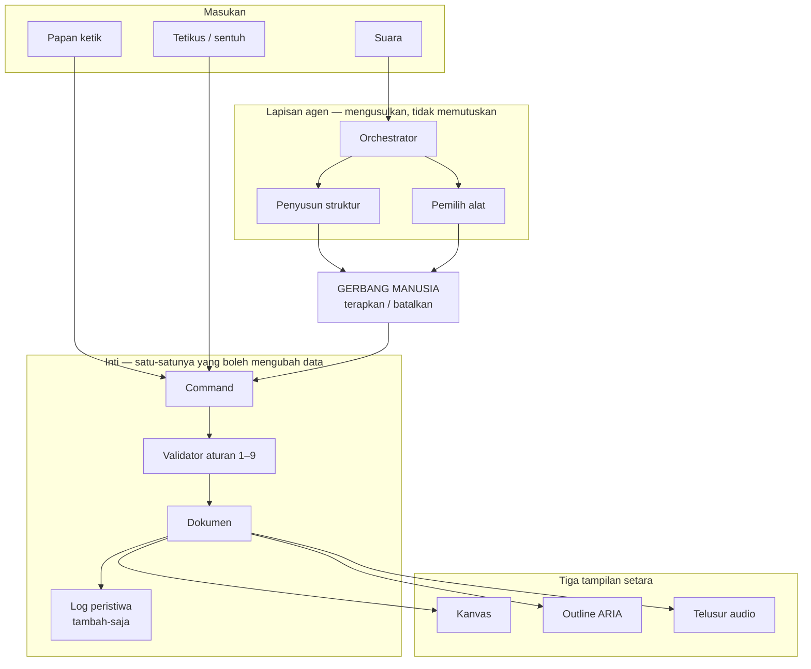
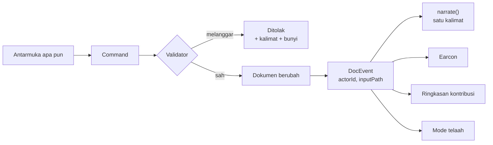
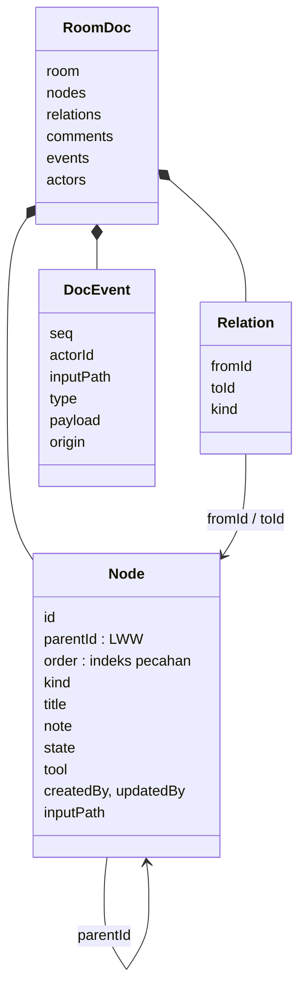
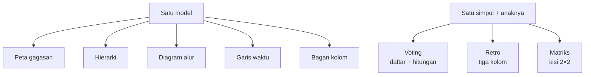
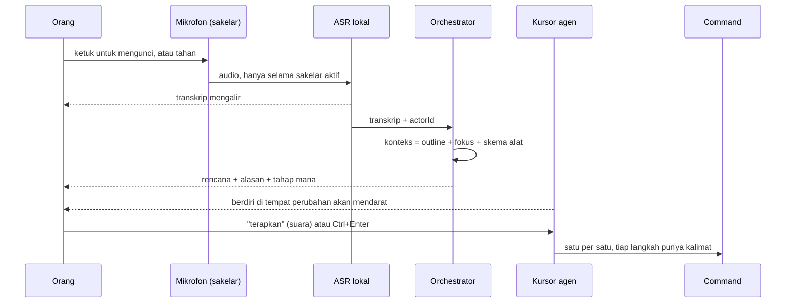
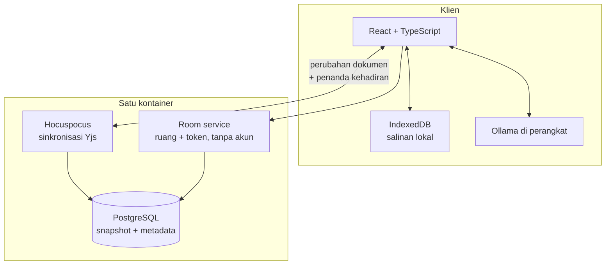

# Arsitektur

Gambar versi PNG ada di `docs/img/`. Diagram di bawah ditulis dengan Mermaid
supaya bisa diubah tanpa membuka aplikasi gambar; PNG-nya hasil render dari
sumber yang sama.

Dokumen ini menjelaskan **bentuk sistemnya**. Yang menjelaskan kenapa keputusan
tertentu diambil ada di catatan keputusan `CLAUDE.md`.

> **Membuat ulang PNG-nya.** Sumbernya cuma satu — blok Mermaid di berkas ini.
> `docs/img/_sources.json` diambil dari sini, dan `docs/img/render.html`
> merendernya. Tidak ada diagram yang diketik dua kali, jadi gambar tidak bisa
> melenceng dari teksnya tanpa ada yang sengaja membuatnya melenceng.

---

## 1. Lapisan




Tiga hal yang dikunci gambar ini:

1. **Papan ketik dan tetikus masuk langsung ke command.** Mereka tidak melewati
   agen, karena tidak ada yang perlu ditafsirkan.
2. **Suara tidak pernah sampai ke command tanpa melewati gerbang.**
3. **Ketiga tampilan membaca dokumen yang sama.** Tidak ada tampilan yang
   menurunkan isinya dari tampilan lain.

---

## 2. Satu pintu menuju data




`DocEvent` ada sejak P0 dan bukan kemewahan: **satu struktur melayani empat
fitur.** Atribusi tidak bisa ditambahkan belakangan tanpa membuat halaman
ringkasan berbohong.

Di mana tiap aturan ditegakkan:

| Aturan | Ditegakkan di | Bagaimana |
| ------ | ------------- | --------- |
| 1 satu induk | `checkMove`, `projectTree` | Pindah ke keturunan sendiri ditolak; siklus dipulihkan saat membaca |
| 2 tanpa makna di koordinat | `core/model/types.ts` | `Node` tidak punya `x`, `y`, `width`, `color` |
| 3 semua bertipe | `checkKind` | Tipe di luar daftar ditolak |
| 4 judul sepanjang napas | `checkTitle` | 60 karakter |
| 5 satu peristiwa satu kalimat | `narrate.ts` | Tipe peristiwa tanpa kalimat = kesalahan kompilasi |
| 6 tiga jalur | tinjauan manusia | Tidak bisa dipaksa mesin; ada di daftar periksa |
| 7 aksesibilitas bawaan | tidak ada sakelar | Tidak ada mode aksesibel untuk dinyalakan |
| 8 batal + narasi + gerbang | `MemoryDocStore.undo`, dialog | Snapshot; perubahan berat lewat dialog |
| 9 audio langka | `audio/bus.ts` | Profil menyaring; narasi menunggu jeda bicara |

---

## 3. Model data




Yang membuat model ini tahan gabungan:

- **`parentId` satu field LWW + indeks pecahan** untuk urutan, bukan array anak
  di dalam induk. Array menghasilkan duplikat saat pindah bersilangan, dan
  duplikat tidak bisa dideteksi. LWW paling buruk menghasilkan siklus, dan
  siklus bisa dipulihkan deterministik (D9, D10).
- **Tidak ada koordinat.** Penempatan tangan disimpan di perangkat, per bentuk
  visual, tidak pernah masuk dokumen (D31).
- **`tool` cuma menyatakan cara menggambar.** Isinya anak-anaknya sendiri, jadi
  alat tidak pernah memiliki data (D40).

---

## 4. Bentuk visual dan alat: tata letak, bukan tipe data




Bentuk menata seluruh ruang; alat menata satu simpul beserta anaknya. Keduanya
**algoritma tata letak atas model yang sama**, bukan tipe data baru — dan itulah
kenapa mengganti bentuk aman dan mematikan alat tidak menghilangkan apa pun.

Matriksnya bukti paling jelas bahwa aturan 2 itu keunggulan: kuadran adalah
simpul kelompok, jadi letak sebuah item bisa dibacakan dengan kata, dan
memindahkannya antar kuadran cuma `moveNode`.

---

## 5. Jalur suara




Yang dijaga di jalur ini:

- **Mikrofon hidup hanya selama sakelar aktif** — janji privasi yang bisa
  diucapkan dalam satu kalimat.
- **Transkrip mengalir** — itu yang membuat 2–3 detik terasa nol.
- **Yang dikirim ke model struktur, bukan tangkapan layar**, dan bisa dibaca
  orang sebelum dijawab.
- **Menerapkan itu pertunjukan**, bukan penumpahan: tiga operasi jadi tiga
  kalimat yang bisa diikuti pembaca layar.

---

## 6. Penyimpanan dan sinkronisasi




**Yang melintasi jaringan hanya dua hal: perubahan dokumen dan penanda
kehadiran.** Tidak ada audio, tidak ada gambar, tidak ada koordinat. Justru
karena itu ruang ini tetap nyaman di sambungan lemah.

Dua mode pemasangan, **beda konfigurasi saja**:

| | Mode kelas | Mode lintas daerah |
| - | ---------- | ------------------ |
| Tempat | Satu laptop pengajar | Klaster institusi |
| Basis data | SQLite | PostgreSQL |
| Jaringan | Lokal, tanpa internet | Publik atau intranet |
| Model | Ollama di perangkat | Ollama, atau vLLM institusi |

PostgreSQL jadi bawaan untuk pemasangan sungguhan (keputusan pemilik proyek,
8 September 2026). SQLite tetap ada khusus mode kelas: memasang Postgres di
laptop pengajar yang cuma dipakai satu ruangan adalah beban tanpa imbalan.

Redis, Traefik, dan orkestrasi kontainer masuk **hanya kalau Hocuspocus lebih
dari satu instans**. Sebelum itu tujuh komponen untuk melayani dua hal.

---

## 7. Struktur folder

```
src/
  core/            tidak mengenal React sama sekali
    model/         tipe, id, indeks pecahan
    rules/         invarian aturan 1–9
    tree/          proyeksi + pemulihan siklus
    commands/      command -> validasi -> peristiwa
    events/        tipe peristiwa + narrate()
    shape/         lima algoritma tata letak
    tools/         registry alat + hitungan suara
    templates/     templat sebagai kumpulan createNode
    agent/         orchestrator, konteks, penyedia, set uji
  store/           DocStore + implementasi memori + data contoh
  a11y/            announcer, peta tuts, papan ketik pohon
  audio/           bus + kosakata earcon
  views/           kanvas, outline
  features/        dok suara, kehadiran, komentar, ruang, perintah
  pages/           enam halaman
  ui/              ikon, dialog, label, tema
```

Aturan yang menjaga ini tetap rapi: **`core/` tidak boleh mengimpor apa pun dari
`views/`, `features/`, atau `pages/`.** Itu yang membuat set uji bisa berjalan di
node tanpa DOM, dan yang membuat `core/` bisa diuji tanpa merender apa pun.

---

## 8. Yang belum dibangun

Ditulis supaya tidak ada yang mengira gambar di atas seluruhnya sudah jadi.

| Bagian | Status |
| ------ | ------ |
| ASR lokal, VAD | Diganti kalimat kalengan |
| Hocuspocus, room service, PostgreSQL | Belum ada; klien memakai `MemoryDocStore` |
| IndexedDB | Belum |
| Kehadiran sungguhan | Data contoh |
| Perapi judul | Terdaftar, belum berjalan |
| Pengamat dinamika | Rancangan, mati secara bawaan — `docs/agent-design.md` |

Yang **sudah** berjalan sungguhan: model data dan validatornya, lima bentuk tata
letak, tiga alat, orchestrator dengan dua penyedia (pencocokan aturan dan Ollama
`qwen2.5:7b` dengan constrained decoding), set uji, undo snapshot, narasi,
earcon, telusur audio, dan enam halaman antarmuka.
