# Lampiran D — Rancangan Antarmuka per Halaman

Tangkapan layar Karsa, 1440×900, tema terang. Semuanya dari aplikasi yang
berjalan, dibuat ulang dengan `npm run shots`.

Urutannya mengikuti **alur pemakaian**, bukan daftar halaman: masuk, memilih
ruang, bekerja di kanvas, menyusun dengan suara, mengikuti perubahan, lalu
meninjau. Beberapa halaman muncul lebih dari sekali karena yang perlu
diperlihatkan adalah keadaannya, bukan halamannya.

---

## D.1 Halaman masuk

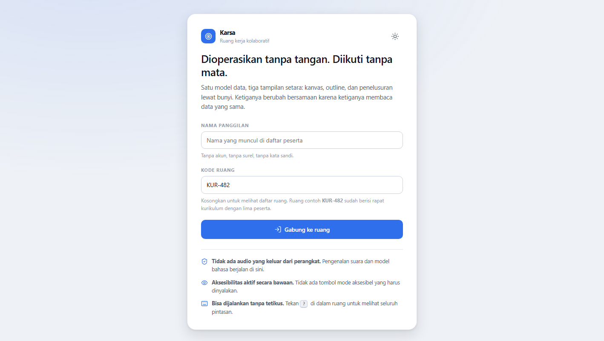

Pintu masuknya satu kartu dengan dua isian: nama panggilan dan kode ruang. Tidak
ada kata sandi, tidak ada surel, tidak ada pendaftaran — nama itu sekadar label
yang muncul di daftar peserta, dan kode ruang itulah kuncinya. Kode dikosongkan
untuk melihat daftar ruang, atau diisi untuk langsung masuk.

Tiga janji produk disebutkan di sini, sebelum orang menyerahkan apa pun: audio
tidak keluar dari perangkat, aksesibilitas aktif secara bawaan tanpa tombol yang
harus dinyalakan, dan seluruh aplikasi bisa dijalankan tanpa tetikus. Ketiganya
ditaruh di halaman pertama karena janji yang baru disebut setelah orang masuk
adalah janji yang tidak dipakai untuk memutuskan.

---

## D.2 Daftar ruang

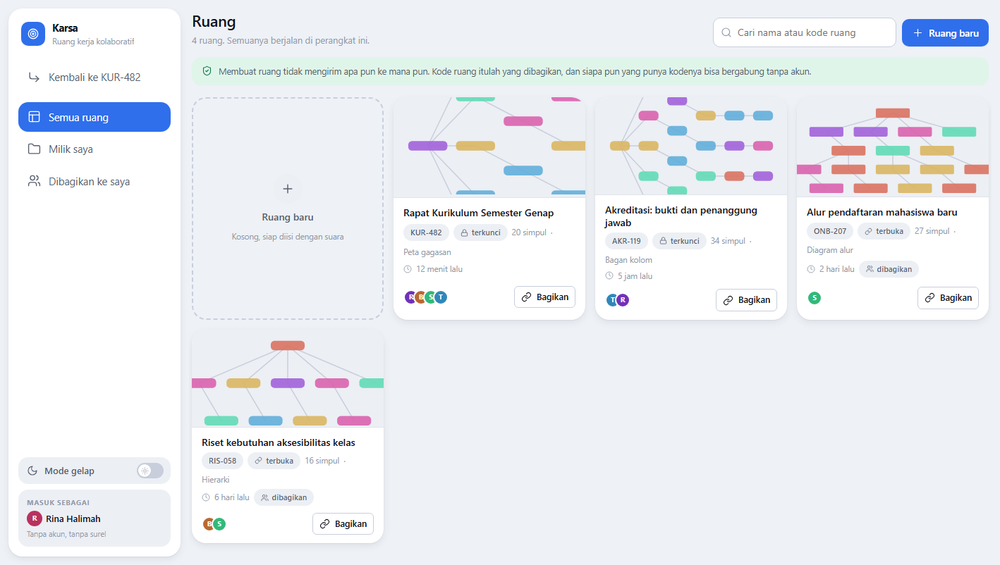

Tiap ruang jadi satu kartu bergambar isinya, sehingga daftar bisa dipindai
sebelum dibaca. Gambarnya dihasilkan dari bentuk dan ukuran ruang, dan ia
`aria-hidden`: nama, kode, jumlah simpul, dan keadaan akses ada di sebelahnya
sebagai kata, jadi gambar tidak pernah menjadi satu-satunya cara mengetahui isi
sebuah ruang.

Kartu bergaris putus di kotak pertama adalah tempat membuat ruang baru — bentuk
dari benda yang akan dibuat, di posisi ia akan muncul. Tiap kartu menandai
aksesnya: **terkunci** berarti kode cuma membawa orang sampai depan pintu,
**terbuka** berarti siapa pun yang punya kode langsung masuk.

Navigasi kiri memuat saringan ruang dan sakelar tema. Sakelar temanya digambar
sebagai sakelar sungguhan dan menyandang `role="switch"`, jadi pembaca layar
membacanya "mode gelap, aktif" alih-alih menyisakan tebakan.

---

## D.3 Membuat ruang

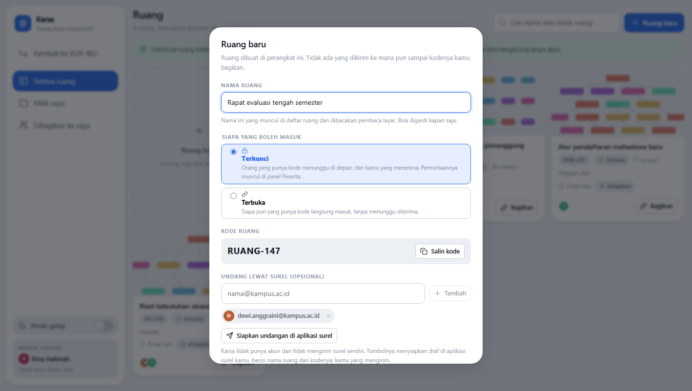

Membuat ruang menanyakan tiga hal yang cuma bisa dijawab di awal. **Nama ruang**,
supaya daftar tidak penuh kartu bernama sama. **Siapa yang boleh masuk**, dua
keadaan yang sama dengan yang dipakai Drive dan Zoom, bawaannya terkunci karena
ongkos salah pilih cuma berat ke satu arah. **Undangan lewat surel**, opsional.

Kode ruang sudah tercetak sebelum ruangnya dibuat, lengkap dengan tombol salin —
sehingga kodenya bisa ditempel ke percakapan sementara namanya masih diketik.

Undangan surelnya berhenti tepat di batas janji produk: tidak ada akun dan tidak
ada server surel di sini, jadi tombolnya **menyiapkan draf di aplikasi surel
pengguna** berisi nama ruang dan kodenya. Tidak ada yang dikirim sistem, dan
alamat yang diketik tidak pernah meninggalkan perangkat.

---

## D.4 Ruang kanvas

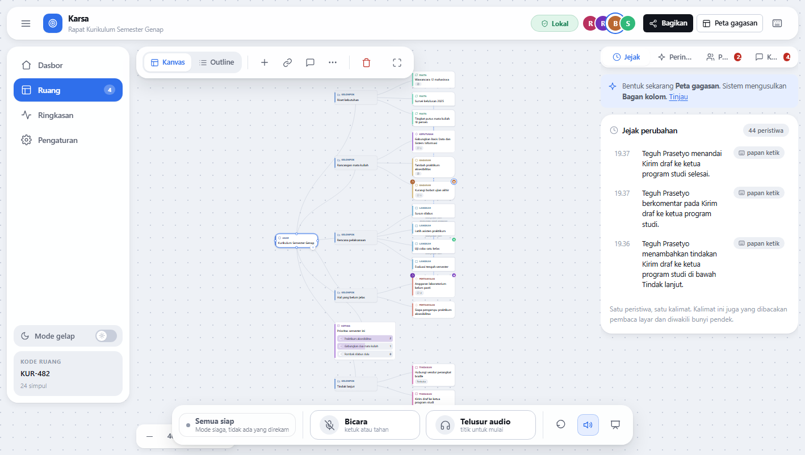

Kanvas adalah latar seluruh jendela; semua perabot mengambang di atasnya.
Susunan ini disengaja: benda yang orang datangi tidak boleh cuma kebagian sisa
ruang setelah panel-panel mengambil bagiannya.

Tiap simpul membawa tipenya lewat empat jalur sekaligus — ikon, kata, warna, dan
siluet kartu — karena warna saja gagal untuk sebagian orang, dan siluetnya
meminjam kosakata diagram alur yang sudah dikenal.

Bilah alat kiri atas memuat perpindahan tampilan (Kanvas/Outline), lalu tambah
simpul, hubungkan, komentar, dan tombol titik tiga untuk alat dan templat.
Semuanya satu kartu satu baris: dua bilah bertumpuk di sudut yang sama adalah
dua benda yang harus dilewati sebelum sampai ke papan.

Dok di bawah memuat status asisten dan dua tombol utama, **Bicara dan Telusur
audio, berukuran sama dan berdampingan**. Ukurannya sama bukan kebetulan:
keduanya jalur utama bagi dua persona berbeda, dan membuat salah satunya lebih
kecil berarti menyatakan salah satunya kurang penting.

---

## D.5 Daftar perintah

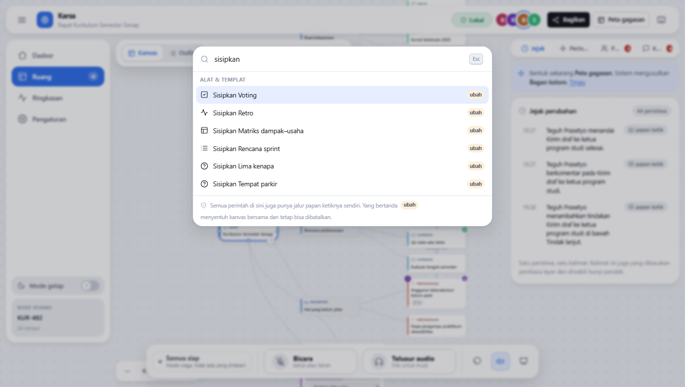

`Ctrl+K` membuka setiap perintah, alat, templat, bentuk kanvas, perpindahan
halaman, dan sakelar tampilan dalam satu daftar yang bisa dicari. Tidak ada
kemampuan baru di dalamnya — semuanya sudah punya tombol atau pintasan. Ini
jalan menuju yang pintasannya belum dihafal, dan itulah bentuk paling langsung
dari aturan bahwa setiap fitur harus bisa dicapai dari papan ketik.

Bentuknya combobox di atas listbox, pola yang sudah dikenal pembaca layar:
mengetik menyaring, panah menggerakkan pilihan aktif, `Enter` menjalankan,
`Escape` keluar — dan fokus tidak pernah berpindah dari kolom ketik.

Perintah yang menyentuh kanvas bersama ditandai **ubah**. Perintah yang belum
bisa dijalankan tetap terdaftar beserta alasannya, bukan dihilangkan: "Pilih
simpul dulu" menolong, entri yang lenyap tanpa penjelasan tidak.

---

## D.6 Alat dan templat

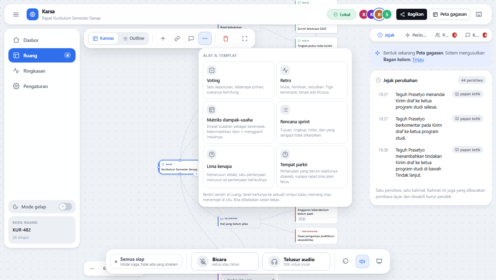

Tombol titik tiga membuka enam templat rapat yang benar-benar dipakai tim:
voting, retro, matriks dampak–usaha, rencana sprint, lima kenapa, dan tempat
parkir. Templat bukan jenis benda baru — ia sekumpulan simpul bertipe yang sudah
dipilihkan, persis yang akan diketik orang tanpa mengetik, jadi ia terbaca di
outline begitu mendarat dan bisa dibatalkan sekali tekan.

Templat mendarat **berdiri sendiri**, tidak menempel ke simpul yang kebetulan
terpilih. Voting atau papan retro biasanya urusannya sendiri, dan menguburnya di
bawah simpul yang tidak berhubungan membuat outline membacakan hubungan yang
tidak pernah dimaksudkan siapa pun.

---

## D.7 Alat di atas kanvas

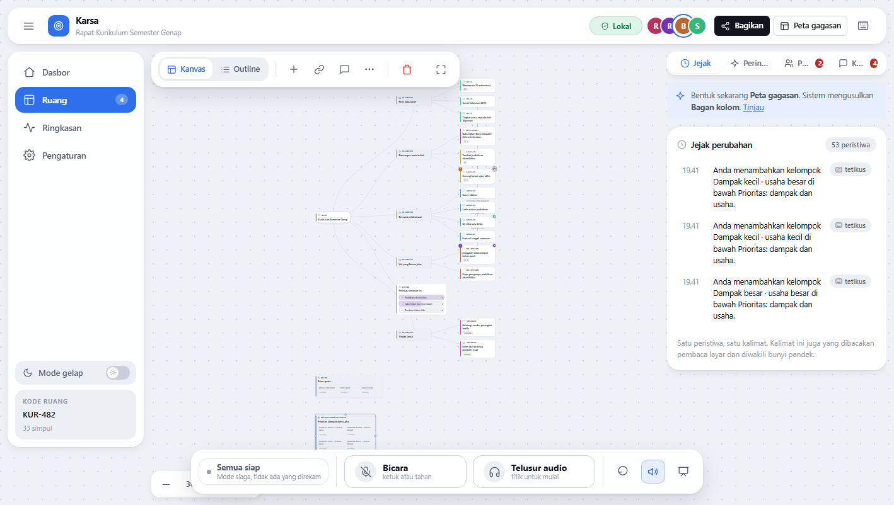

Tiga alat tergambar bersama: voting sebagai daftar berhitungan suara, retro
sebagai tiga kolom, dan matriks dampak–usaha sebagai kisi 2×2.

Yang penting dari rancangan ini bukan tampilannya, melainkan bahwa **alat tidak
pernah memiliki data**. Isi sebuah alat adalah anak-anaknya sendiri: pilihan
voting adalah simpul, kolom retro adalah simpul kelompok, kuadran matriks adalah
simpul kelompok. Akibatnya alat ikut terbaca di outline, ikut penelusuran audio,
ikut pembatalan, dan mematikannya tidak menghilangkan apa pun.

Matriksnya contoh paling jelas. Karena kuadran adalah simpul dan bukan wilayah di
layar, letak sebuah item bisa **dibacakan dengan kata** — "Dampak besar · usaha
kecil › Tambah praktikum aksesibilitas" — sesuatu yang hilang total di papan
kerja lain bagi yang tidak melihat. Memindahkan item antar kuadran cuma
mengganti induknya, sehingga ia dapat dibatalkan dan dinarasikan tanpa satu baris
pun ditulis untuk itu.

Panel kanan menunjukkan jejak perubahan: **satu peristiwa, satu kalimat.**
Kalimat yang sama itulah yang dibacakan pembaca layar dan diwakili bunyi pendek.

---

## D.8 Outline

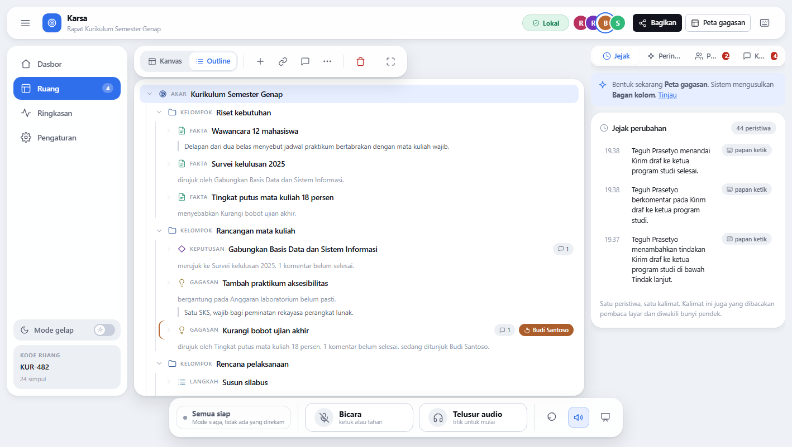

Outline bukan ringkasan kanvas dan bukan salinannya — ia tampilan lain atas data
yang sama, memakai pola ARIA tree yang sungguhan dengan roving tabindex. Mengubah
sesuatu di sini mengubahnya di kanvas pada saat yang sama, karena keduanya
membaca dokumen yang sama.

Tiap baris membawa keterangan yang tidak terlihat di kanvas tetapi terbaca
pembaca layar: status, hubungan ke simpul lain, jumlah komentar yang belum
selesai, siapa sedang menunjuknya, dan hitungan suara bila baris itu bagian dari
voting. Inilah tampilan yang membuat persona B bisa mengikuti rapat tanpa
bergantung pada rekan yang bersedia membacakan.

---

## D.9 Merekam ucapan

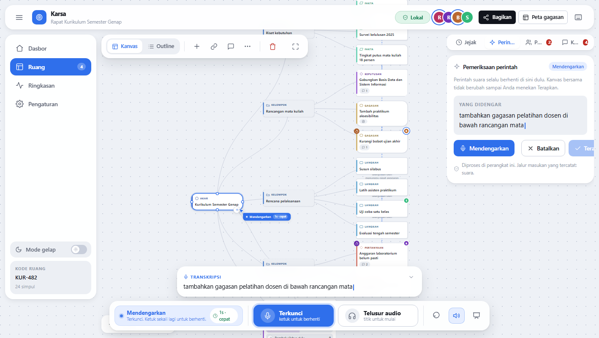

Mikrofon hidup **hanya selama sakelar bicara aktif**. Sakelarnya mengunci bila
diketuk dan berperilaku tekan-tahan bila ditahan — dua perilaku dalam satu
tombol, karena menahan tombol selama satu kalimat justru sulit bagi orang yang
memakai suara persis karena hal semacam itu sulit.

Transkrip muncul kata demi kata sambil diucapkan, di panel dan juga di kartu
mengambang di atas dok. Aliran itu bukan hiasan: ia yang membuat penantian dua
sampai tiga detik terasa nol, dan ia yang membuat salah dengar ketahuan sebelum
sempat menjadi operasi.

---

## D.10 Usulan menunggu persetujuan

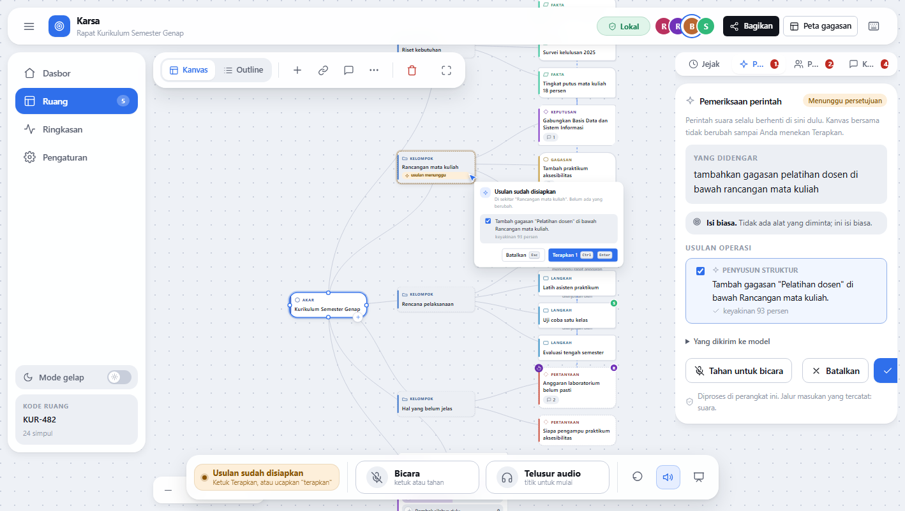

Inilah gerbang yang memisahkan asisten dari kanvas bersama. Perintah suara selalu
berhenti di sini dulu; kanvas tidak berubah sampai seseorang menekan Terapkan.

Panel menampilkan tiga hal sebelum apa pun mendarat. **Yang didengar**, apa
adanya. **Cara sistem meruteknnya** beserta alasannya — di gambar ini "Isi biasa.
Tidak ada alat yang diminta" — sehingga pengguna bisa membantah bagian yang salah
saja, bukan menerima atau menolak seluruh jawaban. Dan **usulan operasinya**,
masing-masing dengan tahap yang menghasilkannya serta angka keyakinan.

Kursor asisten berdiri di kanvas tepat pada simpul yang akan disentuh, bukan
menunggu di panel yang harus dicari. Konfirmasi yang muncul di tempat pekerjaan
akan mendarat langsung dipahami.

Usulannya bisa dijawab dengan suara: saat usulan terpampang, ucapan berikutnya
dibaca sebagai jawaban, bukan perintah baru. Itu yang membuat lingkaran bicara →
tinjau → terapkan tidak menuntut satu jari pun.

---

## D.11 Yang dikirim ke model

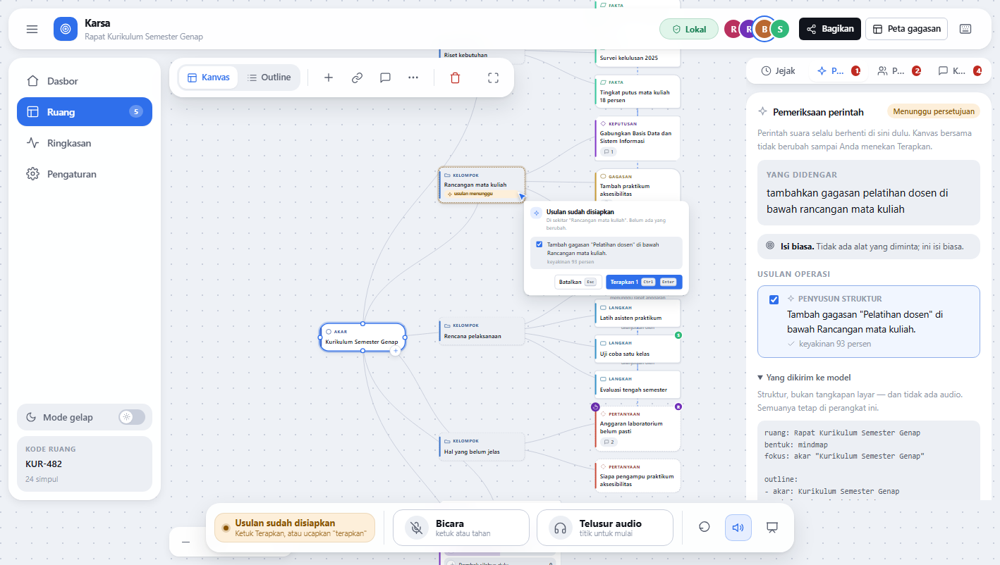

Blok "Yang dikirim ke model" bisa dibuka dan berisi persis apa yang diterima
model bahasa sebelum menjawab: outline ringkas ruang, simpul yang sedang
difokus, dan skema tiap alat.

Ini janji privasi yang dibuat **bisa diperiksa**, bukan sekadar diucapkan. Yang
dikirim adalah struktur, bukan tangkapan layar, dan tidak ada audio sama sekali —
dan pengguna tidak perlu percaya pada kalimat itu, karena isinya ada di layar.
"Percaya saja" bukan fitur aksesibilitas.

---

## D.12 Peserta dan ruang tunggu

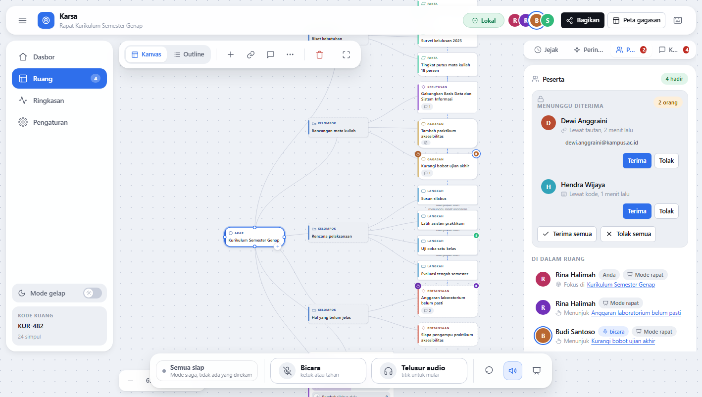

Panel peserta menunjukkan siapa hadir, siapa sedang berbicara, dan simpul mana
yang sedang ditunjuk masing-masing. Menunjuk disimpan sebagai id simpul, bukan
posisi kursor — itulah yang membuat "yang ini" punya rujukan di ketiga tampilan:
cincin di kanvas, keterangan di baris outline, dan nama di daftar ini.

Di atasnya ada ruang tunggu untuk ruang terkunci. Penempatannya mengikuti Zoom,
bukan Drive, dan bedanya menentukan: Drive menjawab permintaan akses di kotak
masuk berjam-jam kemudian, yang tidak berguna ketika rapatnya sedang berlangsung.
Zoom menjawabnya di panel peserta pada detik yang sama. Tombol Terima dan Tolak
ada di baris orangnya, dan tiap jawaban jadi satu kalimat yang diumumkan serta
satu bunyi pendek — karena daftar peserta persis hal yang tidak bisa dilirik
pengguna tunanetra.

---

## D.13 Komentar

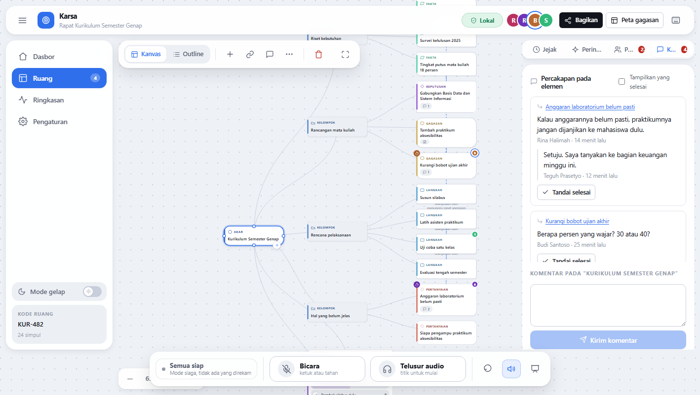

Komentar menempel pada simpul, bukan berdiri sebagai kanal percakapan terpisah.
Alasannya sederhana: komentar yang menempel pada gagasan masih bisa dipahami
seminggu kemudian, sementara kanal percakapan berisi seratus pesan tanpa rujukan
tidak.

---

## D.14 Menyembunyikan panel

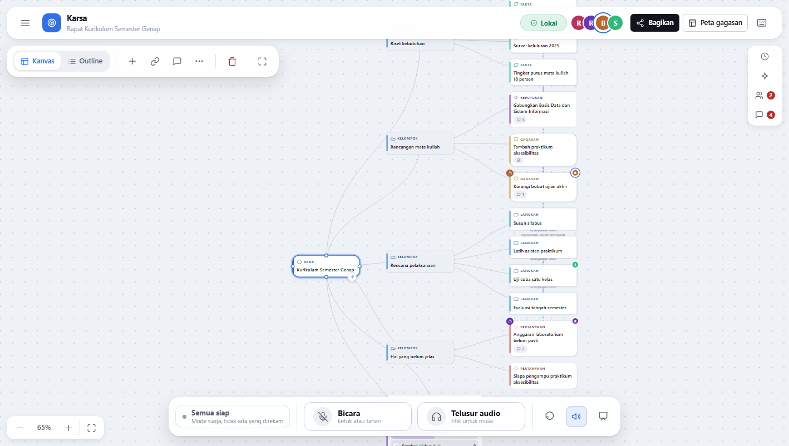

Navigasi kiri dan panel kanan sama-sama bisa disembunyikan, dan ruangnya
**langsung kembali ke kanvas** — offset perabot ditulis sebagai variabel, jadi
menyembunyikan panel bukan sekadar menutupinya melainkan mengembalikan tempatnya.
Panel yang tertutup menyisakan rel tab sempit di tepi kanan, karena panel yang
bisa ditutup butuh jalan pulang yang kelihatan.

Ini bagian dari pilihan yang sama dengan menjadikan kanvas sebagai latar seluruh
jendela: fokus ada pada papan, dan segala sesuatu yang tidak sedang dipakai bisa
menyingkir.

---

## D.15 Membagikan ruang

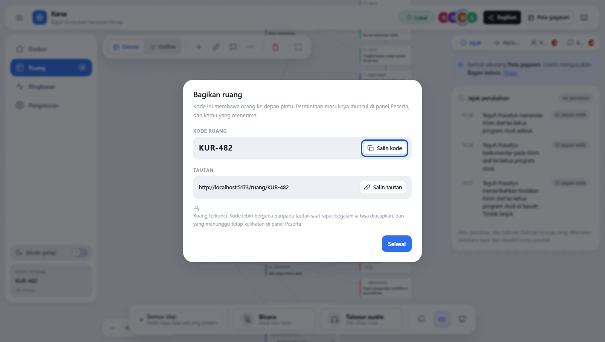

Berbagi menampilkan kode lebih dulu, tautan kedua. Urutannya disengaja: **kode
bisa diucapkan di tengah rapat dan tautan tidak.** Untuk ruang terkunci,
dialognya menyebutkan bahwa kode itu membawa orang ke depan pintu dan permintaan
masuknya muncul di panel peserta.

Tidak ada undangan yang dikirim sistem dan tidak ada akun yang perlu dibuat
penerimanya.

---

## D.16 Daftar pintasan

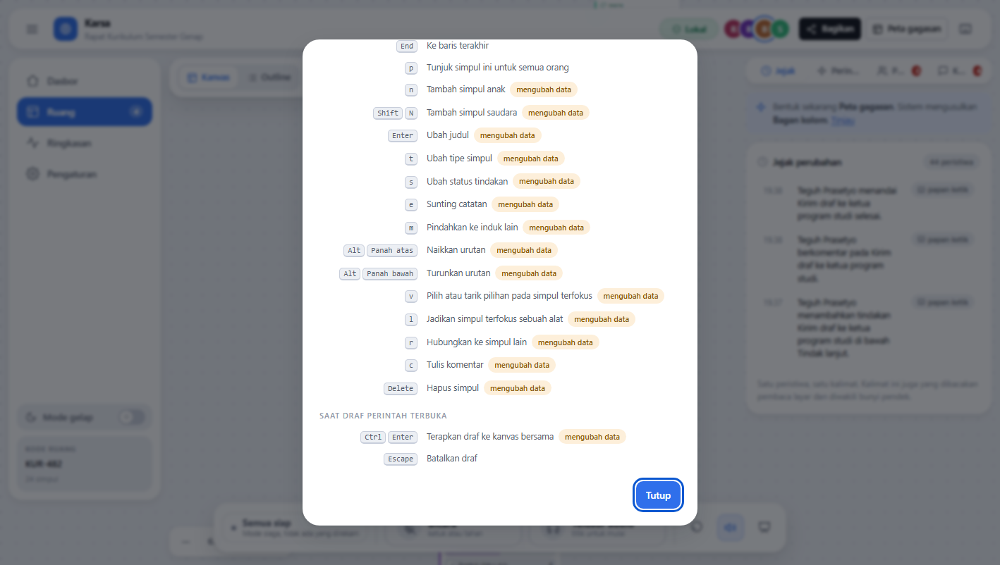

`?` membuka seluruh peta pintasan, dikelompokkan menurut tempat berlakunya, dan
menandai mana yang mengubah kanvas bersama. Daftar ini bukan dokumentasi
tambahan melainkan **kontrak**: setiap barisnya harus benar-benar bekerja, karena
bagi orang yang menavigasi dengan papan ketik, daftar inilah peta satu-satunya.

---

## D.17 Ringkasan sesi

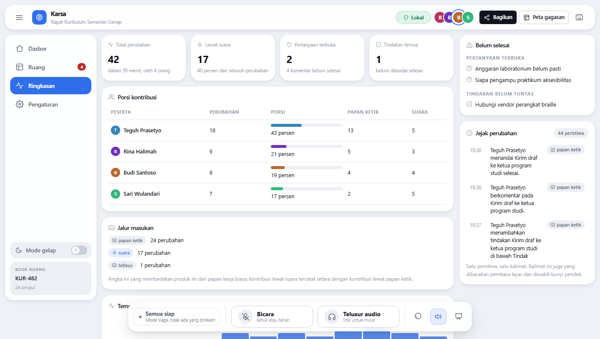

Akhir sesi menampilkan porsi kontribusi tiap peserta, dihitung dari jejak
peristiwa dan **dipecah menurut jalur masukan**: papan ketik, suara, tetikus.

Angka inilah yang membedakan Karsa dari papan kerja biasa. Kontribusi lewat suara
tercatat setara dengan kontribusi lewat papan ketik — dan bagi seseorang yang
selama ini perannya bergeser dari penyusun menjadi pendengar karena gagasannya
baru sampai ke kanvas kalau ada rekan yang bersedia menuliskannya, angka itu
bukan statistik melainkan bukti.

---

## D.18 Pengaturan

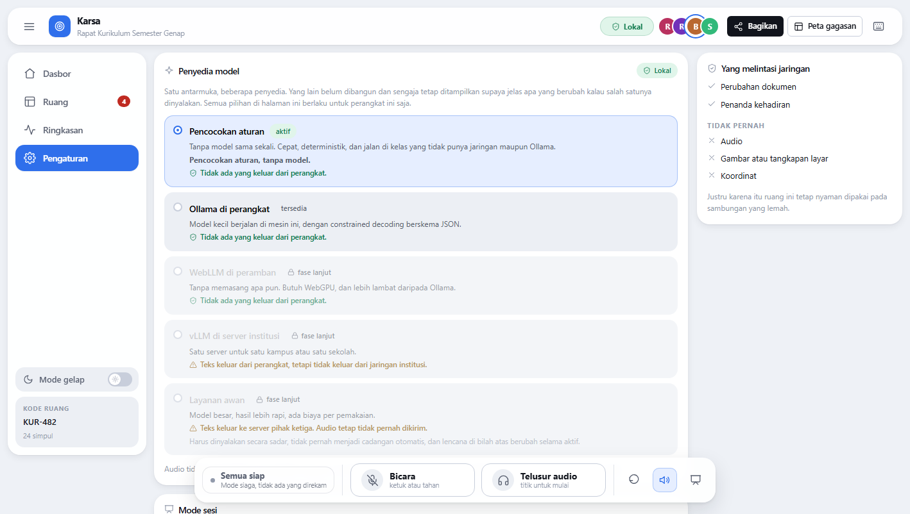

Pengaturan memuat profil bunyi, mode sesi, tema, dan penyedia model.

Daftar penyedianya menampilkan yang belum dibangun dalam keadaan nonaktif, bukan
disembunyikan, karena layar pengaturan yang menyembunyikan pilihannya yang belum
jadi mengajarkan bentuk produk yang keliru. Baris yang paling penting di tiap
penyedia bukan nama modelnya melainkan **ke mana kata-katanya pergi** — dan
untuk penyedia yang aktif, keterangan tambahan menyebut apa yang benar-benar
tersedia di mesin ini, bukan apa yang dikonfigurasikan.

Layanan awan disebutkan lengkap dengan harganya bagi privasi dan dengan
peringatan bahwa menyalakannya harus sadar dan mengubah lencana di bilah atas.
Ia tidak pernah menjadi cadangan otomatis.

---

## Catatan untuk penyusun laporan

Semua gambar di atas dihasilkan `npm run shots` (butuh `npm run dev` berjalan di
terminal lain). Menambah adegan berarti menambah satu baris di `SCENES` pada
`scripts/shots.mjs` dan satu paragraf di dokumen ini.

Tema gelap tidak disertakan sebagai gambar untuk menjaga laporan tetap ringkas;
sakelar temanya terlihat pada D.2 dan D.18. Jendela sempit juga tidak
disertakan — tata letaknya menyesuaikan, dengan panel kanan berubah menjadi
lembar bawah dan navigasi kiri menyusut jadi rel ikon.
